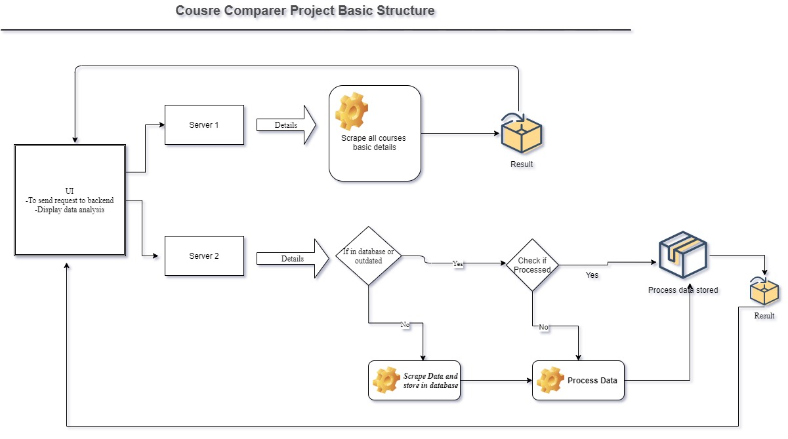

# Course-Comparer
A backend of a website designed to compare courseera courses and analyse and performe phase extraction of reviews. 

For better understanding look at the notebook provided. It is the detailed breakdown of the code used.

## Project outline

